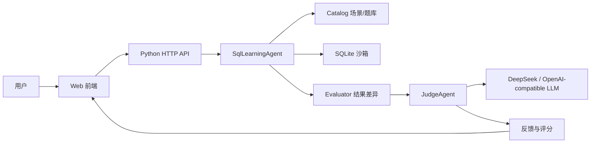

# SQL Agent Coach

基于大模型 Agent 的 SQL 辅助学习系统。项目面向 SQL 初学者和进阶练习者，围绕“生成数据库、生成题目、提交 SQL、Agent 判题、错因分析、学习建议”形成完整训练闭环。

本仓库为 `vibecoding_homework_4db` 作业项目，核心代码位于 [`sql-agent-coach/`](sql-agent-coach/)。

## 项目亮点

- **自动生成练习环境**：内置电商订单、校园课程两个业务场景，启动后自动创建 SQLite schema 与实例数据。
- **多类型 SQL 题目**：覆盖筛选查询、连接查询、聚合统计、子查询、窗口函数等题型。
- **Agent 判题闭环**：先执行参考 SQL 与用户 SQL，再把结构化结果差异交给 `JudgeAgent` 裁决。
- **DeepSeek / OpenAI-compatible 接入**：支持配置 DeepSeek API，默认模型可使用 `deepseek-v4-flash`。
- **可离线兜底运行**：未配置 API Key 时使用本地规则判题，确保系统可以稳定演示。
- **一键测试样例**：每道题内置正确、错误、语法错误、安全拦截样例，可直接载入或运行。
- **学习反馈与统计**：自动返回得分、错因解释、下一步建议、平均分和正确率。

## 效果预览

启动后访问本地页面：

```text
http://127.0.0.1:8000
```

页面包含：

- 左侧：场景选择、题目筛选、schema 与样例数据
- 中间：题目描述、测试样例、SQL 编辑区
- 右侧/下方：判题反馈、用户结果、参考结果、Agent 答疑

## 系统架构



核心思路：

1. 系统为每个 session 创建独立 SQLite 内存数据库。
2. 用户提交 SQL 后，系统执行参考 SQL 与用户 SQL。
3. `Evaluator` 构造列、行、结果内容、执行错误等结构化信息。
4. `JudgeAgent` 调用大模型返回 JSON 裁决：`correct`、`score`、`feedback`、`next_steps`。
5. 如果没有配置外部模型，系统自动使用本地规则兜底。

## 快速开始

### 1. 克隆仓库

```powershell
git clone git@github.com:KazeBox33/vibecoding_homework_4db.git
cd vibecoding_homework_4db\sql-agent-coach
```

### 2. 启动系统

项目默认只依赖 Python 标准库，无需额外安装依赖即可运行：

```powershell
python app.py
```

浏览器打开：

```text
http://127.0.0.1:8000
```

## 接入 DeepSeek Judge Agent

如果希望真正使用大模型 Agent 判题，在启动前设置环境变量：

```powershell
$env:DEEPSEEK_API_KEY="你的 DeepSeek API Key"
$env:SQL_COACH_JUDGE_PROVIDER="deepseek"
$env:SQL_COACH_LLM_MODEL="deepseek-v4-flash"
$env:SQL_COACH_LLM_BASE_URL="https://api.deepseek.com"

python app.py
```

也可以只设置 `DEEPSEEK_API_KEY`，系统会自动选择 DeepSeek 默认配置：

```powershell
$env:DEEPSEEK_API_KEY="你的 DeepSeek API Key"
python app.py
```

启用后，前端 Agent 状态会显示 `LLM Agent 判题`，判题结果中会标记 `LLM Judge Agent`。

## 通用 OpenAI-Compatible 配置

如果使用其他兼容 Chat Completions 的服务：

```powershell
$env:SQL_COACH_LLM_API_KEY="你的 API Key"
$env:SQL_COACH_LLM_MODEL="你的模型名"
$env:SQL_COACH_LLM_BASE_URL="https://api.openai.com/v1/chat/completions"

python app.py
```

## 测试

运行单元测试：

```powershell
cd sql-agent-coach
python -m unittest discover -s tests
```

当前测试覆盖：

- schema 与样例数据生成
- 正确 SQL 判题
- 错误 SQL 反馈
- 非只读 SQL 安全拦截
- Judge Agent 接管判题
- DeepSeek 配置识别
- 前端测试样例数据返回

## 项目结构

```text
vibecoding_homework_4db/
  README.md
  sql-agent-coach/
    app.py
    core/
      agent.py
      catalog.py
      judge_agent.py
    static/
      index.html
      app.js
      styles.css
    docs/
      technical_report.md
      output.pptx
    tests/
      test_agent.py
```

## 关键文件

| 文件 | 说明 |
| --- | --- |
| `sql-agent-coach/app.py` | 本地 HTTP 服务与 API 路由 |
| `sql-agent-coach/core/agent.py` | 学习流程编排、题目生成、判题入口 |
| `sql-agent-coach/core/judge_agent.py` | DeepSeek / LLM Judge Agent 接入 |
| `sql-agent-coach/core/catalog.py` | 场景库、schema、样例数据、题库 |
| `sql-agent-coach/static/` | 浏览器交互界面 |
| `sql-agent-coach/docs/technical_report.md` | 技术原理与架构报告 |
| `sql-agent-coach/docs/output.pptx` | 演示 PPT |

## 当前实现说明

当前没有引入 LangChain、OpenClaw 或 Hermes 作为运行时依赖，而是采用轻量自定义 Agent 编排：

- SQLite 作为工具执行层
- Evaluator 负责构造结果差异
- JudgeAgent 调用 DeepSeek 或 OpenAI-compatible 大模型
- 本地规则判题作为兜底策略

这种实现更轻量，便于本地运行和课堂演示。如果课程要求必须展示 LangChain 等框架，也可以把 `JudgeAgent` 替换为 LangChain `Runnable` 或 `AgentExecutor`。

## 安全策略

系统只允许执行 `SELECT` 或 `WITH` 开头的只读 SQL，并拦截：

- 多语句执行
- `DROP`
- `INSERT`
- `UPDATE`
- `DELETE`
- `ALTER`
- `CREATE`
- `ATTACH`
- `DETACH`

这样可以保证练习过程中不会破坏内存数据库。

## 交付内容

- 可运行 Web 系统
- DeepSeek Judge Agent 接入
- SQL 题库与测试样例
- 单元测试
- 技术报告
- 演示 PPT
