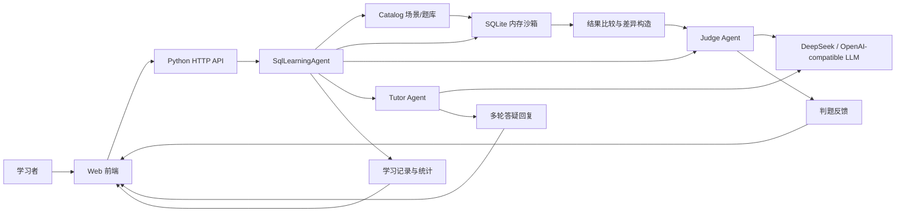
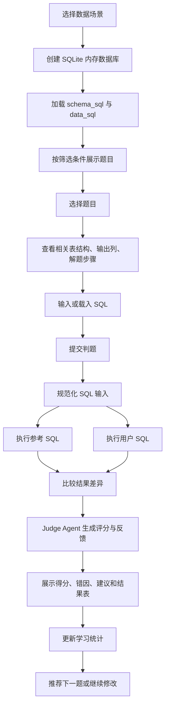
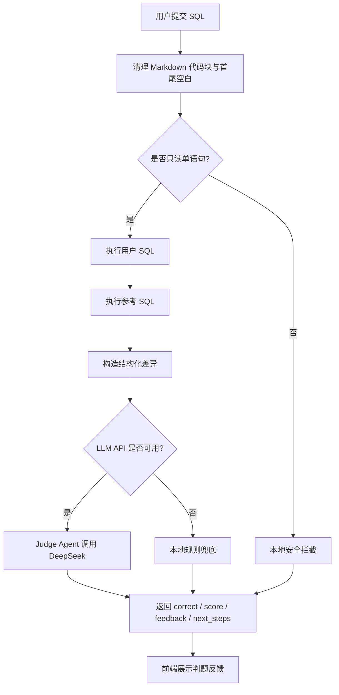
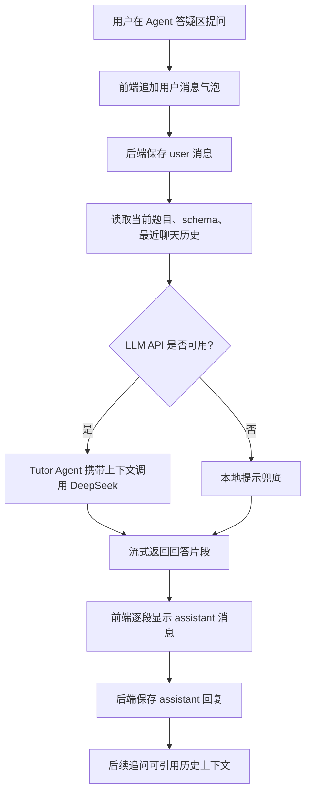
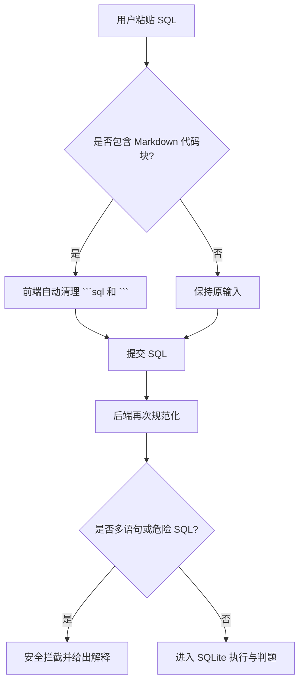

# SQL Agent Coach 功能与流程总结

本文档总结当前项目的功能模块、核心业务流程、Agent 判题/答疑机制，以及系统整体架构。

## 1. 项目定位

SQL Agent Coach 是一个基于大模型 Agent 的 SQL 辅助学习系统。系统面向 SQL 初学者和进阶练习者，提供从“数据库生成、题目练习、SQL 执行、Agent 判题、错因分析、答疑辅导、学习建议”的完整闭环。

项目支持 DeepSeek / OpenAI-compatible 模型接入。当前本地已适配 DeepSeek `deepseek-v4-flash`，用于 Judge Agent 判题与 Tutor Agent 答疑。

## 2. 功能模块

| 模块 | 功能说明 |
| --- | --- |
| 数据库场景生成 | 内置电商订单、校园课程两个业务场景，自动创建 SQLite 表结构与样例数据 |
| SQL 题库 | 支持筛选查询、连接查询、聚合统计、子查询、窗口函数等题型 |
| 题目辅助信息 | 每题展示相关表结构、样例数据、目标输出列、建议解题步骤 |
| 灵活选题 | 支持按场景、难度、题型、知识点、关键词筛选，支持随机选题和推荐下一题 |
| SQL 编辑与提交 | 用户输入 SQL 后提交判题，支持自动清理复制粘贴时带入的 Markdown 代码块 |
| SQLite 执行沙箱 | 用户 SQL 和参考 SQL 都会在内存 SQLite 中真实执行，避免只靠大模型猜测 |
| Judge Agent 判题 | 将题目、schema、用户结果、参考结果、执行错误交给大模型进行结构化裁决 |
| Tutor Agent 答疑 | 支持多轮会话记忆和流式回复，能结合当前题目与历史聊天回答追问 |
| 测试样例 | 每道题内置正确、错误、语法错误、安全拦截样例，可一键载入或运行 |
| 学习统计 | 记录每次提交，展示平均分、正确率，并生成后续学习建议 |
| 安全拦截 | 只允许 `SELECT` / `WITH` 查询，拦截多语句和 `DROP`、`INSERT`、`UPDATE` 等危险操作 |

## 3. 系统整体架构



## 4. 练习主流程



## 5. Judge Agent 判题流程



Judge Agent 并不是凭空判断 SQL。系统会先在 SQLite 中实际执行 SQL，再把执行结果、参考结果、错误信息、题目信息传给大模型。这样既能保证判题依据真实，也能让反馈更像教学解释。

## 6. Tutor Agent 答疑流程



当前 Tutor Agent 会在同一练习 session 中记住最近 10 条聊天记录，用于理解追问。例如：

- “刚才那一步为什么要 GROUP BY？”
- “我已经写了 JOIN，下一步呢？”
- “这个字段应该来自哪张表？”

## 7. SQL 输入容错流程



该设计解决了用户从文档、Agent 回复、Markdown 代码块中复制 SQL 时容易误提交 ```sql 标记的问题。

## 8. 关键文件说明

| 文件 | 作用 |
| --- | --- |
| `app.py` | 本地 HTTP 服务、API 路由、静态页面服务 |
| `core/catalog.py` | 数据场景、建表 SQL、样例数据、题库 |
| `core/agent.py` | 学习流程编排、SQLite 执行、判题入口、聊天会话记忆 |
| `core/judge_agent.py` | DeepSeek / OpenAI-compatible 调用、Judge Agent、Tutor Agent、流式输出 |
| `static/index.html` | 前端页面结构 |
| `static/app.js` | 前端交互、题目筛选、判题提交、流式聊天 |
| `static/styles.css` | 页面样式 |
| `tests/test_agent.py` | 单元测试 |
| `docs/technical_report.md` | 技术原理与架构报告 |
| `docs/output.pptx` | 演示 PPT |

## 9. 当前交付能力对照

| 作业要求 | 当前实现 |
| --- | --- |
| 生成数据库模式和实例数据 | 已实现，使用内置场景生成 SQLite 内存数据库 |
| 生成不同类型和难度 SQL 查询题目 | 已实现，支持多题型、多难度、筛选与推荐 |
| 判断用户答案对错 | 已实现，SQLite 执行结果比较 + Judge Agent 裁决 |
| 错题解析 | 已实现，LLM Judge Agent 给出反馈与建议 |
| 答疑 | 已实现，Tutor Agent 支持多轮上下文与流式回复 |
| 最终成绩和分析改进建议 | 已实现，记录提交、统计平均分与正确率 |
| 可运行 demo | 已实现，本地访问 `http://127.0.0.1:8000` |
| 技术原理和架构报告/PPT | 已实现，见 `docs/technical_report.md` 与 `docs/output.pptx` |

## 10. GitHub 提交说明

本仓库只提交当前项目相关内容：

```text
README.md
sql-agent-coach/
```

不会提交外层 `E:\New project` 工作目录本身，也不会提交运行日志、`.server.pid`、缓存文件或临时构建目录。
