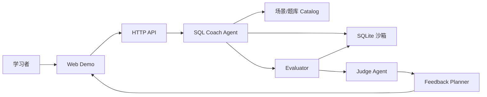

# 基于大模型 Agent 的 SQL 辅助学习系统

## 1. 项目定位

SQL Agent Coach 是一个面向 SQL 初学者和进阶学习者的随身教练系统。系统围绕“生成数据环境、生成练习题、Agent 判题反馈、答疑、总结建议”形成学习闭环。

系统包含可配置的 `JudgeAgent`。配置 LLM API 后，判题阶段会调用外部 Agent 进行结构化裁决；未配置密钥时使用本地规则兜底，便于离线运行和课堂展示。

## 2. 功能闭环

1. 生成数据库模式与实例数据  
   系统内置电商订单、校园课程两个场景。每个场景包含 schema DDL、样例数据和业务描述，启动练习时在内存 SQLite 中生成独立数据库。

2. 生成不同题型和难度的 SQL 题目  
   题库覆盖筛选查询、连接查询、聚合统计、子查询和窗口函数，难度分为入门、进阶、挑战。前端可按场景、难度、题型筛选。

3. Agent 判题与错因解析  
   系统先执行参考 SQL 和用户 SQL，生成结构化结果差异，再交给 `JudgeAgent` 进行判题。LLM Agent 返回 `correct / score / feedback / next_steps` JSON；若未启用外部模型，则使用本地规则兜底。

4. 答疑与提示  
   用户可针对 schema、JOIN、聚合、当前题目提问。当前实现为规则答疑，可替换为 LLM function calling 或 ReAct 工具调用。

5. 成绩与改进建议  
   系统记录每次提交，计算平均分、正确率，并根据错题知识点给出学习建议。

## 3. Agent 架构



核心模块：

- `Catalog`：保存场景、schema、样例数据、题目、参考 SQL、知识点和提示。
- `SqlLearningAgent`：负责创建学习会话、生成题目、组织判题、答疑和进度报告。
- `JudgeAgent`：调用 OpenAI-compatible Chat Completions 风格接口，让外部 LLM Agent 参与 SQL 裁决；不可用时自动切到本地兜底。
- `SQLite Sandbox`：每个 session 拥有独立内存数据库，只允许执行 SELECT/WITH 查询。
- `Evaluator`：执行用户 SQL 与参考 SQL，比较结果集并计算分数。
- `Feedback Planner`：将错误转成可读反馈与下一步建议。

## 4. 判题策略

系统使用“结果等价优先”的判题方式：

- 先执行参考 SQL 得到期望结果。
- 再执行用户 SQL 得到实际结果。
- 若结果完全相同，判定正确。
- 若行顺序不同但内容一致，也判定正确。
- 若失败或不一致，把执行错误、输出列、行数、知识点命中、期望结果和实际结果交给 Judge Agent 裁决。

为保护数据库，系统拒绝非只读语句、多语句执行和 `DROP/INSERT/UPDATE/DELETE/CREATE/ALTER` 等关键字。

## 5. LLM 扩展方案

当前版本已经实现 `JudgeAgent` 接入。启动前设置环境变量即可启用外部 LLM 判题：

DeepSeek：

```powershell
$env:DEEPSEEK_API_KEY="你的 DeepSeek API Key"
$env:SQL_COACH_JUDGE_PROVIDER="deepseek"
$env:SQL_COACH_LLM_MODEL="deepseek-v4-flash"
$env:SQL_COACH_LLM_BASE_URL="https://api.deepseek.com"
python app.py
```

系统会把 `https://api.deepseek.com` 转为 Chat Completions 请求地址，并在请求体中携带 `reasoning_effort` 与 `thinking` 参数。

通用 OpenAI-compatible 服务：

```powershell
$env:SQL_COACH_LLM_API_KEY="你的 API Key"
$env:SQL_COACH_LLM_MODEL="你的模型名"
$env:SQL_COACH_LLM_BASE_URL="https://api.openai.com/v1/chat/completions"
python app.py
```

当前工程没有引入 LangChain、OpenClaw 或 Hermes 作为运行时依赖。它采用自定义 Agent 编排：`SQLite Sandbox` 作为工具执行层，`Evaluator` 构造差异，`JudgeAgent` 调用大模型返回结构化裁决。若课程要求必须展示 LangChain 等框架，可在 `JudgeAgent` 位置替换为 LangChain Runnable / AgentExecutor。

后续还可以扩展以下节点：

- 题目生成：让 LLM 根据 schema、难度、知识点生成题干和参考 SQL，再由 SQLite 校验参考答案可运行。
- 错因解释：当前已支持 Judge Agent 参与，可继续升级为带工具调用的 ReAct 或 function calling 流程。
- 自适应学习路径：根据历史表现动态选择下一题，构造个性化学习计划。
- 多 Agent 分工：Schema Agent 生成数据库，Problem Agent 出题，Judge Agent 判题，Tutor Agent 答疑，Planner Agent 总结建议。

## 6. 运行与交付

运行：

```powershell
cd "E:\New project\sql-agent-coach"
python app.py
```

访问：

```text
http://127.0.0.1:8000
```

测试：

```powershell
python -m unittest discover -s tests
```

交付物：

- 可运行 demo：`app.py` + `static/` + `core/`
- 技术报告：`docs/technical_report.md`
- 演示 PPT：`docs/output.pptx`
